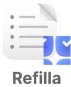

### 👋 Hi there
I'm a passionate Mobile Developer and Software Engineer with strong experience in building scalable, user-focused mobile apps using Flutter. I aim to create digital solutions that not only perform well but also make a positive impact on people and society.
<br>
<p align="center">
    <a href="mailto:krish.techx@gmail.com">
      
    </a>
    <a href="https://www.linkedin.com/in/krish-techx">
      
    </a>
</p>

## Expertise
I’ve primarily worked in Waterfall-style development cycles, delivering full-feature releases and refining apps based on real-world feedback from diverse user groups.

Beyond mobile development, I explore Unity and Blender 3D to craft immersive indie games. These creative projects help me bring stories and ideas to life, blending logic with imagination.

Whether it's through building real-world applications or experimenting with game mechanics, I’m committed to developing with purpose — focusing on clean architecture, performance, and meaningful user experiences.

I’m driven by the idea that technology can empower lives, and I’m constantly learning and collaborating to become part of that change.

## Projects
<table width="100%" cellspacing="0" cellpadding="16" style="background:#f0f8ff;">
  <tr>
    <td width="100%" align="left" valign="top">
      <!--  Title  -->
      <h3>
        
        Refilla
      </h3>      
      <!--  Description  -->
      <p>
        Refilla is your smart assistant for managing kitchen and household inventory. Track what’s in stock, get alerts for low or out-of-stock items, and create smart grocery lists in           seconds.
      </p>
      <h4>Features:</h4>
      <ul>
        ▪️Offline-first inventory tracking <br>
        ▪️ Restock reminders <br>
        ▪️ Smart local data handling <br>
        ▪️ Minimal, fast mobile UI <br>
      </ul>
      <p><strong>Tech Stack:</strong> Flutter, Provider, SharedPreferences</p>
      <p><strong>Repo:</strong>  
        <a href="https://github.com/krish-techx/refilla">github.com/krish-techx/refilla</a>
      </p>
    </td>
  </tr>
</table>

## Tech Stack
```yaml
🔹 Languages: Dart, Java, C#, SQL
🔹 Frameworks: Flutter
🔹 State Management: Provider
🔹 Backend & APIs: REST APIs, JSON
🔹 Databases: SQLite, Firebase
🔹 Platforms: Android, Web
🔹 Tools: Postman, VS Code, HeidiSQL, Android Studio, Figma
🔹 Version Control: Git, GitHub
🔹 Additional Tools: Unity Engine, Blender 3D
```

## My Streak
<p>
  
</p>
